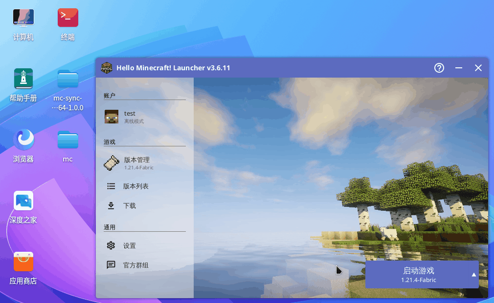

## 1，文件组成

以Windows版本为例，在下载并解压程序之后，得到如下文件：


分别是：

- `mc-sync-client.exe` 模组同步客户端主程序，为一个命令行程序
- `client-config.yaml` 配置文件，包含同步服务器地址等信息

对于Linux操作系统，解压后类似，得到下列文件：


只不过，可执行文件没有`exe`扩展名。

在Linux操作系统中，需要先赋予其可执行权限，否则后续无法运行同步客户端程序，打开终端并`cd`进入`mc-sync-client`所在目录下，执行下列命令：

```bash
chmod +x mc-sync-client
```

建议将这两个文件放到Minecraft游戏目录中（`.minecraft`目录的所在目录下）如图：


## 2，配置文件

### (1) 配置内容

配置文件为[YAML格式](https://www.runoob.com/w3cnote/yaml-intro.html)，默认的内容如下：

```yaml
# 基本配置
base:
  # 客户端模组文件夹
  mod-folder: ".minecraft/mods"
# 同步服务器连接配置
server:
  host: "127.0.0.1"
  port: 25566
# 文件同步相关配置
sync:
  # 同步时同时下载的模组数量
  fetch-concurrency: 2
  # 软删除
  soft-remove: true
  ignore-file-names:
    - "example-mod.jar"
# 退出延迟，同步完成后延迟多少秒退出，若设为0则同步完成立即退出
# 建议设定延迟几秒，以便于查看同步日志，排查错误
exit-delay: 3
```

配置意义可参考上述注释内容，需要注意的是：

- 对于`base.mod-folder`配置为游戏模组文件夹，可以是相对路径或者绝对路径，若使用反斜杠`\`作为分隔符，请使用双反斜杠代替，例如`E:\\game\\xxx`，如果是相对路径，则同步客户端会根据其**运行路径**为参照寻找模组，一般来说运行路径就是`mc-sync-client.exe`的所在目录，如果游戏开启了版本隔离功能，请修改该配置为`.minecraft/versions/${game_version}/mods`，将`${game_version}`替换为你实际的游戏版本
- 同步服务端配置`server.host`和`server.port`请从服务器管理员，即搭建游戏服务器和同步服务器的那一方获得，如果你是服务器管理员兼整合包制作者，也可以将其提前配置好
- 对于本地存在但是服务端不存在的模组，会被视为多余模组并被删除，如果配置了`sync.soft-remove`为`true`，则在移除多余模组时不会实际删除模组，而是将多余模组移动到运行路径下的`mod-backup`目录下，便于后续玩家找回
- 对于一些仅适用于游戏客户端的本地辅助类型模组（例如小地图、高清修复模组等），通常不会被添加于服务端，因此无需同步，可以将对应模组**文件名**加入到配置`sync.ignore-file-names`配置中进行忽略，该配置为一个数组，可加入多个，被忽略的模组不会被视为多余模组被删除

### (2) 配置文件查找位置

在运行`mc-sync-client.exe`时，默认情况下不指定配置文件位置，则程序会依次从下列路径中寻找名为`client-config.yaml`的文件作为配置文件：

- 运行目录
- 程序所在的目录

若找不到配置文件，则会报错并退出。

此外，还可以通过命令行参数指定配置文件，打开任意终端，并`cd`进入`mc-sync-client.exe`所在目录下，执行命令：

```bash
# 指定当前目录下config.yaml为配置文件
./mc-sync-client -c config.yaml
```

通过`-c`标志指定配置文件，可参考后续章节的命令行参考说明。

## 3，进行同步

正确完成配置之后，运行程序即可进行同步。

### (1) 手动同步

双击`mc-sync-client.exe`即可运行程序，完成同步工作。

对于Linux操作系统，可使用命令行调用：

```bash
# 进入目录
cd mc-sync-client所在目录
# 执行程序
./mc-sync-client
```

可通过查看同步日志，判断同步是否完成，同步完成会自动退出。

### (2) 配置到启动器自动同步

显然，每次玩游戏之前手动执行程序并进行同步，是相当麻烦的事情，因此我们可以借助一些启动器的“开始游戏之前运行命令”的功能，在游戏开始之前自动执行我们的`mc-sync-client`程序，完成同步。

下面将游戏文件夹（启动器所在目录，`.minecraft`文件夹所在目录）表示为`${install_dir}`，假设你已经将`mc-sync-client.exe`和配置文件`client-config.yaml`放进了`${install_dir}`，以[HMCL启动器](https://hmcl.huangyuhui.net/)为例，讲解如何配置自动同步。

#### ① 设置位置

打开HMCL启动器，进入**设置**：


在**全局游戏设置**中，往下划，点击**编辑高级设置**：


在**游戏启动前执行命令**这一栏即可进行配置：


下面，将分不同情况，讲解配置命令。

#### ② Windows操作系统的配置命令

对于Windows操作系统，如果你**没有开启版本隔离**，则配置如下：

```bash
cmd /c "cd ../ && mc-sync-client -t"
```

如下图：


可见我们使用`cmd`调用了我们的同步客户端程序，其中`&&`用于连接多条命令，上述命令的解释：

- 首先`cd`切换运行路径为上一级路径以便于调用我们的同步客户端程序，在不开启版本隔离时，启动器调用的命令的运行路径是`${install_dir}/.minecraft`，因此我们切换运行路径到我们同步客户端所在目录
- 然后调用同步客户端，`-t`参数表示进行同步工作时，弹出并显示同步过程的命令行窗口，若不加上该参数，也可以正常进行同步，但是我们无法看到同步过程

类似地，如果你**开启了版本隔离**，则配置如下：

```bash
cmd /c "cd ../../../ && mc-sync-client -t"
```

如下图：


可见是类似的，只不过开启版本隔离时，启动器调用的命令的运行路径是`${install_dir}/.minecraft/versions/你的游戏版本`，因此我们要向上回退三级目录，以便于调用同步客户端。

实现效果如下：


#### ③ Linux操作系统的配置命令

对于Linux操作系统，总体来说思路是一样的，只不过命令略有不同。

对于**没有开启版本隔离**的情况下，配置命令如下：

```bash
../mc-sync-client -t -d
```

如下图：


对于**开启了版本隔离**的情况下，配置命令如下：

```bash
../../../mc-sync-client -t -d
```

如下图：


可见在Linux操作系统，我们可以直接以相对路径形式调用同步客户端，上述命令解释：

- 同样地先要清楚运行路径，才能根据对应的相对路径调用程序：
	- 未开启版本隔离：运行路径是`${install_dir}/.minecraft`
	- 开启版本隔离：运行路径是`${install_dir}/.minecraft/versions/你的游戏版本`
- 使用`-t`参数弹出并显示同步过程的命令行窗口，这一点和Windows一样
- 使用`-d`参数表示强制切换运行路径为`mc-sync-client`所在目录下，保证能够找到配置文件和模组文件夹

> 可见无论是在什么情况下，我们都保证`mc-sync-client`运行路径为`${install_dir}`，保证配置的一致性。

实现效果如下：



需要注意的是，在Linux操作系统下，如果正确配置了同步程序，且在加上`-t`参数的情况下仍然没有弹出终端窗口，说明**当前系统终端不支持被调用导致程序提前退出**，这种情况下可以修改配置命令如下，**将日志重定向到日志文件**：

```bash
# 未开启版本隔离
../mc-sync-client -d >> sync-client.log

# 开启版本隔离
../../../mc-sync-client -d >> sync-client.log
```

或者安装`Xterm`终端后再试：

```bash
sudo apt install xterm
```

## 4，命令行参考

`mc-sync-client`是一个命令行程序，可以双击打开，也可以通过命令行给定对应参数调用，首先需要`cd`进入到程序所在目录下，执行下列命令查看帮助：

```bash
./mc-sync-client -h
```

有如下参数标志可以指定，可同时指定：

- `-c 配置文件`或`--config 配置文件` 指定一个配置文件以启动客户端
- `-d`或`--force-work-directory` 若带上该标志，则会强制程序的工作目录为程序自身的所在目录
- `-t`或`--in-terminal` 若带上该标志，则会调用系统可用的终端模拟器程序（例如cmd、gnome-terminal等）弹出新的窗口运行客户端程序，建议使用游戏启动器调用同步客户端时加上该标志，使得同步过程以及日志能够显现
- `-h`或`--help` 输出帮助信息

下面是一些示例：

```bash
# 指定当前目录下client.yaml为配置文件
./mc-sync-client -c client.yaml

# 指定当前目录下client.yaml为配置文件，并弹出终端窗口启动程序
./mc-sync-client -c client.yaml -t

# 启动程序，并强制程序的运行路径为其自身所在的路径，并弹出终端窗口启动程序
./mc-sync-client -d -t
```